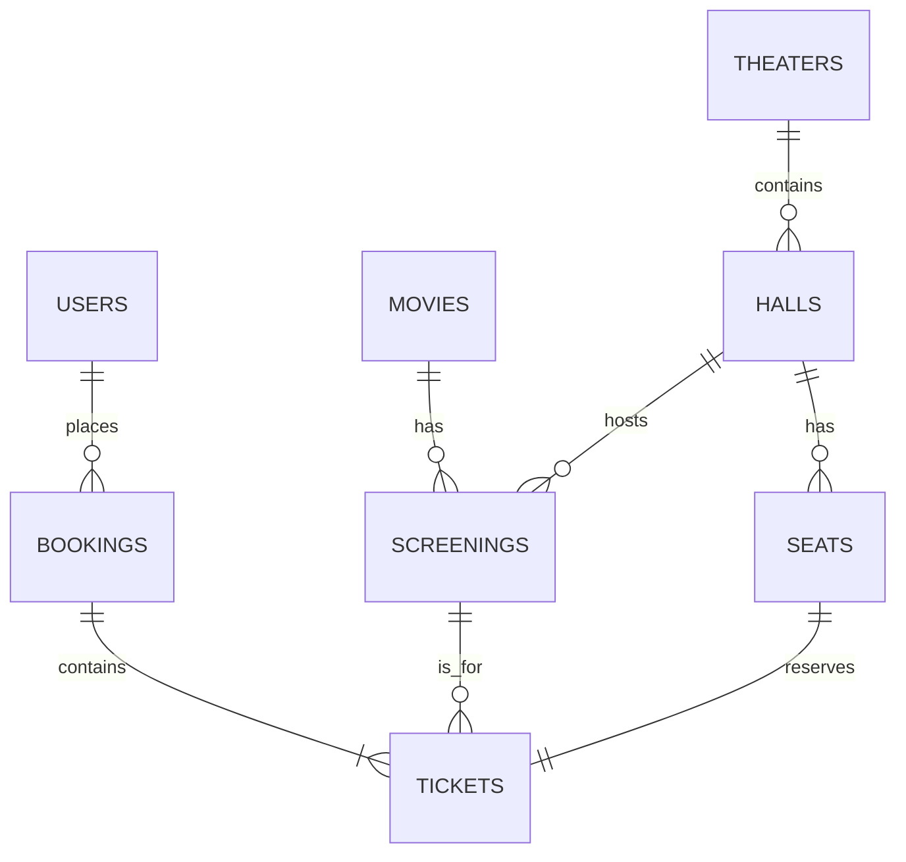

### 总览
我们将分步完成这个项目：

1.  **数据库设计 (核心)**
      * 需求分析与实体识别
      * 绘制 E-R 图
      * 创建数据表 (SQL)
      * 规范化分析
2.  **环境准备**
      * 安装 C++ 开发环境
      * 安装 MySQL 数据库
      * 安装 C++ MySQL 连接器
3.  **C++ 功能实现**
      * 连接数据库
      * 实现增、删、改、查 (CRUD)
      * 实现统计分析功能
4.  **高级数据库功能**
      * 使用视图 (Views)
      * 使用存储过程 (Stored Procedures)
      * 使用触发器 (Triggers)
      * 实现完整性约束
      * 处理并发

-----

### **第一步：数据库设计 (Database Design)**

这是整个系统的基石，一个好的数据库设计至关重要。

#### 1\. 需求分析与实体识别

根据你的需求，一个电影订票系统至少包含以下核心实体：

  * **用户 (Users)**: 登录和订票的客户。
  * **电影 (Movies)**: 正在上映的电影信息。
  * **影院 (Theaters)**: 电影院信息。
  * **影厅 (Halls)**: 每个影院内的具体放映厅。
  * **场次 (Screenings)**: 电影在特定影厅的特定放映时间。
  * **座位 (Seats)**: 影厅中的座位。
  * **订单 (Bookings)**: 用户一次订票的记录。
  * **电影票 (Tickets)**: 每个订单具体包含的票，关联到特定的场次和座位。

#### 2\. E-R 图 (实体-关系图)

E-R 图用于可视化实体之间的关系。下面是这个系统的 E-R 图描述：

  * **用户** 和 **订单** 是一对多关系 (一个用户可以有多个订单)。
  * **订单** 和 **电影票** 是一对多关系 (一个订单可以包含多张电影票)。
  * **场次** 和 **电影票** 是一对多关系 (一个场次会售出多张电影票)。
  * **座位** 和 **电影票** 是一对一关系（在一场放映中，一张票对应一个座位）。
  * **电影** 和 **场次** 是一对多关系 (一部电影可以有多个放映场次)。
  * **影厅** 和 **场次** 是一对多关系 (一个影厅可以安排多个放映场次)。
  * **影院** 和 **影厅** 是一对多关系 (一个影院可以有多个影厅)。

**E-R 图示例:**



#### 3\. 创建数据表 (SQL)

根据 E-R 图，我们可以设计出以下的 MySQL 数据表。

```sql
-- 用户表
CREATE TABLE Users (
    user_id INT AUTO_INCREMENT PRIMARY KEY,
    username VARCHAR(50) NOT NULL UNIQUE,
    password_hash VARCHAR(255) NOT NULL,
    email VARCHAR(100) UNIQUE,
    created_at TIMESTAMP DEFAULT CURRENT_TIMESTAMP
);

-- 电影表
CREATE TABLE Movies (
    movie_id INT AUTO_INCREMENT PRIMARY KEY,
    title VARCHAR(100) NOT NULL,
    director VARCHAR(100),
    duration_minutes INT,
    release_date DATE,
    genre VARCHAR(50),
    rating DECIMAL(3, 1)
);

-- 影院表
CREATE TABLE Theaters (
    theater_id INT AUTO_INCREMENT PRIMARY KEY,
    name VARCHAR(100) NOT NULL,
    location VARCHAR(255)
);

-- 影厅表
CREATE TABLE Halls (
    hall_id INT AUTO_INCREMENT PRIMARY KEY,
    theater_id INT,
    hall_number INT NOT NULL,
    seat_capacity INT,
    FOREIGN KEY (theater_id) REFERENCES Theaters(theater_id) ON DELETE CASCADE
);

-- 场次表
CREATE TABLE Screenings (
    screening_id INT AUTO_INCREMENT PRIMARY KEY,
    movie_id INT,
    hall_id INT,
    start_time DATETIME NOT NULL,
    price DECIMAL(10, 2) NOT NULL,
    FOREIGN KEY (movie_id) REFERENCES Movies(movie_id) ON DELETE CASCADE,
    FOREIGN KEY (hall_id) REFERENCES Halls(hall_id) ON DELETE CASCADE
);

-- 订单表
CREATE TABLE Bookings (
    booking_id INT AUTO_INCREMENT PRIMARY KEY,
    user_id INT,
    booking_time TIMESTAMP DEFAULT CURRENT_TIMESTAMP,
    total_amount DECIMAL(10, 2),
    status ENUM('confirmed', 'cancelled') DEFAULT 'confirmed',
    FOREIGN KEY (user_id) REFERENCES Users(user_id) ON DELETE SET NULL
);

-- 座位表 (用于记录座位信息和判断是否售出)
-- 这里我们简化一下，假设每个场次的座位状态是动态查询的，而不是静态表。
-- 实际项目中可以有一个Seat表记录座位排号，和一个Screening_Seats表记录每个场次的座位状态。

-- 电影票表
CREATE TABLE Tickets (
    ticket_id INT AUTO_INCREMENT PRIMARY KEY,
    booking_id INT,
    screening_id INT,
    seat_row CHAR(1) NOT NULL,
    seat_number INT NOT NULL,
    FOREIGN KEY (booking_id) REFERENCES Bookings(booking_id) ON DELETE CASCADE,
    FOREIGN KEY (screening_id) REFERENCES Screenings(screening_id) ON DELETE CASCADE,
    -- 用户定义完整性约束：同一场次的座位不能重复
    UNIQUE (screening_id, seat_row, seat_number)
);

```

#### 4\. 规范化分析

  * **第一范式 (1NF)**: 所有字段都是原子性的，不可再分。我们的设计符合。
  * **第二范式 (2NF)**: 在满足 1NF 的基础上，非主键字段完全依赖于主键。我们的表都是单主键，因此自动满足 2NF。
  * **第三范式 (3NF)**: 在满足 2NF 的基础上，任何非主键字段不依赖于其他非主键字段（没有传递依赖）。例如，`Halls` 表中的 `theater_id` 直接依赖于 `hall_id`，而没有通过其他非主键传递。我们的设计基本符合 3NF，避免了数据冗余和更新异常。

**结论**: 该数据库设计达到了 **第三范式 (3NF)**，结构清晰，完整性高，适合作为该系统的基础。

-----

### **第二步：环境准备**

1.  **C++ 开发环境**: 确保你安装了 C++ 编译器，如 GCC (MinGW for Windows) 或 Clang，以及一个代码编辑器如 VS Code 或 Visual Studio。
2.  **MySQL 数据库**: 安装 MySQL Community Server。
3.  **MySQL C++ Connector**: 这是让 C++ 程序连接 MySQL 的官方驱动。
      * 访问 MySQL 官网下载 Connector/C++。
      * 在你的 C++ 项目中配置好头文件 (`include`) 和库文件 (`lib`) 的路径。

-----

### **第三步：C++ 功能实现**

这里提供一些核心功能的代码框架和思路。你需要将下载的 MySQL Connector/C++ 库链接到你的项目中。

#### 1\. 登录与数据库连接

```cpp
#include <iostream>
#include <mysql_driver.h>
#include <mysql_connection.h>
#include <cppconn/statement.h>
#include <cppconn/resultset.h>
#include <cppconn/exception.h>

sql::Connection* connectToDB() {
    try {
        sql::mysql::MySQL_Driver *driver;
        sql::Connection *con;

        driver = sql::mysql::get_mysql_driver_instance();
        // 替换成你自己的数据库信息
        con = driver->connect("tcp://127.0.0.1:3306", "your_user", "your_password");
        con->setSchema("your_database_name");

        std::cout << "数据库连接成功!" << std::endl;
        return con;
    } catch (sql::SQLException &e) {
        std::cerr << "数据库连接失败: " << e.what() << std::endl;
        return nullptr;
    }
}

// 登录功能
bool login(sql::Connection* con, const std::string& username, const std::string& password) {
    sql::Statement *stmt;
    sql::ResultSet *res;

    stmt = con->createStatement();
    // 注意：实际项目中应使用预处理语句防止SQL注入！
    res = stmt->executeQuery("SELECT password_hash FROM Users WHERE username = '" + username + "'");
    
    if (res->next()) {
        // 这里只是简单比较，实际项目中密码应该是哈希过的
        if (res->getString("password_hash") == password) {
            std::cout << "登录成功!" << std::endl;
            delete res;
            delete stmt;
            return true;
        }
    }
    std::cout << "用户名或密码错误!" << std::endl;
    delete res;
    delete stmt;
    return false;
}

int main() {
    sql::Connection* con = connectToDB();
    if (con) {
        login(con, "testuser", "password123");
        delete con;
    }
    return 0;
}
```

#### 2\. 增、删、改、查功能 (CRUD)

以 **增加一部电影** 为例，使用 **预处理语句 (PreparedStatement)** 来防止 SQL 注入。

```cpp
#include <cppconn/prepared_statement.h>

void addMovie(sql::Connection* con, const std::string& title, const std::string& director, int duration) {
    try {
        sql::PreparedStatement *pstmt;

        pstmt = con->prepareStatement("INSERT INTO Movies(title, director, duration_minutes) VALUES (?, ?, ?)");
        pstmt->setString(1, title);
        pstmt->setString(2, director);
        pstmt->setInt(3, duration);
        pstmt->executeUpdate();

        std::cout << "电影 '" << title << "' 添加成功!" << std::endl;
        delete pstmt;
    } catch (sql::SQLException &e) {
        std::cerr << "添加电影失败: " << e.what() << std::endl;
    }
}
```

你可以参照这个模式实现删除 (DELETE)、修改 (UPDATE)、查询 (SELECT) 等功能。

#### 3\. 简单的统计分析功能

例如，**统计每部电影的票房排名**。

```cpp
void getMovieRankings(sql::Connection* con) {
    sql::Statement *stmt;
    sql::ResultSet *res;
    
    std::string query = 
        "SELECT m.title, SUM(s.price) AS total_revenue "
        "FROM Tickets t "
        "JOIN Screenings s ON t.screening_id = s.screening_id "
        "JOIN Movies m ON s.movie_id = m.movie_id "
        "GROUP BY m.title "
        "ORDER BY total_revenue DESC";

    try {
        stmt = con->createStatement();
        res = stmt->executeQuery(query);
        
        std::cout << "---- 电影票房排名 ----" << std::endl;
        while (res->next()) {
            std::cout << "电影: " << res->getString("title") 
                      << ", 总票房: " << res->getDouble("total_revenue") << std::endl;
        }
        delete res;
        delete stmt;
    } catch (sql::SQLException &e) {
        std::cerr << "查询排名失败: " << e.what() << std::endl;
    }
}
```

-----

### **第四步：高级数据库功能**

#### 1\. 视图 (View)

创建一个视图来显示即将上映的电影场次信息，简化查询。

```sql
CREATE VIEW UpcomingScreenings AS
SELECT
    m.title AS movie_title,
    th.name AS theater_name,
    h.hall_number,
    s.start_time,
    s.price,
    s.screening_id
FROM Screenings s
JOIN Movies m ON s.movie_id = m.movie_id
JOIN Halls h ON s.hall_id = h.hall_id
JOIN Theaters th ON h.theater_id = th.theater_id
WHERE s.start_time > NOW();
```

在 C++ 中，你可以像查询普通表一样查询这个视图：`SELECT * FROM UpcomingScreenings;`

#### 2\. 存储过程 (Stored Procedure)

创建一个存储过程来处理订票业务，这能保证一系列操作的原子性。

```sql
DELIMITER //

CREATE PROCEDURE BookTicket(
    IN p_user_id INT,
    IN p_screening_id INT,
    IN p_seat_row CHAR(1),
    IN p_seat_number INT
)
BEGIN
    DECLARE v_price DECIMAL(10, 2);
    DECLARE v_booking_id INT;
    DECLARE seat_count INT;

    -- 检查座位是否已被预订
    SELECT COUNT(*) INTO seat_count FROM Tickets 
    WHERE screening_id = p_screening_id AND seat_row = p_seat_row AND seat_number = p_seat_number;

    IF seat_count > 0 THEN
        SIGNAL SQLSTATE '45000' SET MESSAGE_TEXT = '该座位已被预订';
    ELSE
        -- 开启事务
        START TRANSACTION;
        
        -- 获取价格
        SELECT price INTO v_price FROM Screenings WHERE screening_id = p_screening_id;
        
        -- 创建新订单
        INSERT INTO Bookings (user_id, total_amount) VALUES (p_user_id, v_price);
        SET v_booking_id = LAST_INSERT_ID();
        
        -- 插入电影票
        INSERT INTO Tickets (booking_id, screening_id, seat_row, seat_number)
        VALUES (v_booking_id, p_screening_id, p_seat_row, p_seat_number);
        
        -- 提交事务
        COMMIT;
    END IF;
END //

DELIMITER ;
```

在 C++ 中调用它：`CALL BookTicket(1, 101, 'A', 5);`

#### 3\. 触发器 (Trigger)

创建一个触发器，在每次插入一张新票后，自动更新影厅的座位数（如果需要的话）或者做一些日志记录。例如，记录每次订票活动。

```sql
CREATE TABLE BookingLog (
    log_id INT AUTO_INCREMENT PRIMARY KEY,
    booking_id INT,
    log_message VARCHAR(255),
    logged_at TIMESTAMP DEFAULT CURRENT_TIMESTAMP
);

DELIMITER //

CREATE TRIGGER AfterBookingInsert
AFTER INSERT ON Bookings
FOR EACH ROW
BEGIN
    INSERT INTO BookingLog (booking_id, log_message)
    VALUES (NEW.booking_id, CONCAT('新订单创建，用户ID: ', NEW.user_id));
END //

DELIMITER ;
```

#### 4\. 完整性约束

  * **实体完整性**: 通过 `PRIMARY KEY` (如 `user_id`) 保证每条记录唯一且主键不为空。
  * **参照完整性**: 通过 `FOREIGN KEY` 约束 (如 `Tickets` 表中的 `booking_id` 引用 `Bookings` 表) 保证关联数据的有效性。
  * **用户定义完整性**: 通过 `UNIQUE` (如 `Users` 表的 `username`) 和 `CHECK` 约束（MySQL 8.0.16+ 支持）或触发器实现自定义业务规则。我们在 `Tickets` 表中已经用 `UNIQUE (screening_id, seat_row, seat_number)` 实现了“同一场次的座位不能重复”这一规则。

#### 5\. 并发支持

  * **事务 (Transaction)**: C++ 连接 MySQL 时，默认是自动提交模式。对于复杂的业务（如订票），你需要手动管理事务来保证数据一致性。
    ```cpp
    con->setAutoCommit(false); // 关闭自动提交
    try {
        // ... 执行多个SQL语句 ...
        con->commit(); // 全部成功，提交事务
    } catch (sql::SQLException &e) {
        con->rollback(); // 出现错误，回滚事务
    }
    ```
  * **锁机制**: MySQL 的 InnoDB 存储引擎使用行级锁，在高并发读写时性能很好。当你执行 `UPDATE` 或 `SELECT ... FOR UPDATE` 时，它会自动锁定相应的数据行，防止其他事务同时修改，从而保证了多用户同时使用时的数据安全。

希望这个详细的指南能帮助你开始你的电影订票系统项目！祝你编码愉快！
