## **《猿眼电影订票系统》重构项目文档**

### **一、需求说明**

本系统旨在为用户提供一个便捷的在线电影票务平台。经过现代化重构后，系统核心功能需求如下：

1. **用户认证功能**：
    
    - **用户注册**：提供公开的注册页面，用户可以通过用户名、密码、手机号创建新账户。
        
    - **用户登录**：提供登录页面，已注册用户可以通过用户名和密码登录系统，服务器通过会话（Session/Cookie）机制保持登录状态。
        
    - **用户登出**：用户可以主动退出登录，清除登录状态。
        
    - **访问控制**：系统的核心功能页面（如个人中心、购票流程）受路由守卫保护，未登录用户将被自动重定向到登录页面。
        
2. **电影信息浏览功能**：
    
    - **电影列表**：在主页展示当前热映的电影列表，以卡片形式包含电影海报和名称。
        
    - **电影详情**：用户可以点击电影卡片，跳转到详情页，查看电影的详细信息，包括简介、时长、上映日期等。
        
3. **核心票务流程功能**：
    
    - **场次选择**：在电影详情页，用户可以点击购票，进入该电影的场次选择页面，查看不同影院、影厅、时间和价格的场次。
        
    - **座位选择**：选择场次后，进入该场次的虚拟座位图页面，用户可以直观地看到可选和已售座位，并进行点选或取消选择操作。
        
    - **订单确认**：选定座位后，进入订单确认页面，汇总显示电影、场次、座位和总价信息。
        
    - **订单创建**：用户确认订单后，系统会在后端数据库中创建一条新订单记录，并同步更新对应场次的座位图，将被选座位标记为“已售”。
        
4. **用户个人中心功能**：
    
    - **信息展示**：显示当前登录用户的头像、用户名和手机号。
        
    - **订单查询**：提供“我的订单”入口，用户可以查看自己所有的历史订单列表。
        
    - **收藏管理**：用户可以在电影详情页将电影标记为“想看”或“已看”，并在个人中心的收藏页面查看这两个列表。
        
    - **优惠券查询**：提供“我的优惠券”入口，展示用户拥有的优惠券。
        
5. **后台管理功能**：
    
    - 提供一个安全的、需要管理员登录才能访问的后台管理界面。
        
    - 管理员可以在后台对系统的核心数据进行增、删、改、查（CRUD）操作，包括管理用户、电影、场次、订单、评论、收藏和优惠券等。
        
6. **数据自动化填充功能**：
    
    - 提供命令行脚本，可通过爬虫程序从豆瓣电影 Top 250 网站自动抓取电影数据。
        
    - 提供命令行脚本，可将抓取的数据以及自动生成的模拟场次数据批量填充到数据库中，以提高开发和测试效率。
        

---

### 二、**系统设计**

本系统采用前后端分离的现代 Web 架构。前端作为用户直接交互的单页应用（SPA），后端作为提供 RESTful API 的无状态服务。

- **运行环境**：
    
    - 后端服务通过 **Docker** 进行容器化部署，运行在标准的 Linux 环境中，数据库和缓存服务同样由 Docker 管理。
        
    - 前端应用通过 Node.js 环境中的 **Vite** 开发服务器运行，最终可被构建为静态文件，由 Nginx 等 Web 服务器托管。
        
- **开发语言**：
    
    - **后端**：**Python 3.10+**，利用其成熟的生态和简洁的语法进行快速开发。
        
    - **前端**：**TypeScript**，为 JavaScript 提供了静态类型检查，增强了代码的健壮性和可维护性。
        
- **数据库管理系统**：
    
    - 采用 **MariaDB (兼容 MySQL)**，一个功能强大且完全开源的关系型数据库管理系统，用于持久化存储所有业务数据。同时使用 **Redis** 作为高速缓存和会话存储。
        
- **系统模块结构**：
    
    1. **后端 (Flask Server)**
        
        - **模型层 (`models.py`)**: 使用 SQLAlchemy 定义所有数据库表的 ORM 模型，是数据结构的核心。
            
        - **API 接口层 (`api/`)**: 使用 Flask-RESTX 构建。每个业务模块（如用户、电影、订单）都有独立的接口文件，负责处理业务逻辑和数据交互。
            
        - **应用工厂 (`__init__.py`)**: 采用应用工厂模式构建 Flask 应用，实现了插件的统一初始化和蓝图的注册，结构清晰，易于扩展。
            
        - **管理后台 (`admin.py`)**: 使用 Flask-Admin 构建，为数据模型提供了一套功能完整的 CRUD web 界面。
            
        - **数据填充 (`server.py`, `scraper.py`)**: 提供自定义的 Flask CLI 命令 (`flask seed`, `flask seed-screens`) 和独立的爬虫脚本，实现了数据的自动化填充。
            
    2. **前端 (Vue App)**
        
        - **视图层 (`views/`)**: 存放页面级别的 Vue 组件，如登录页、主页、详情页等，按照业务功能分目录存放。
            
        - **路由层 (`router/`)**: 使用 Vue Router 管理应用的页面跳转和访问权限，包含全局路由守卫以实现用户认证检查。
            
        - **状态管理层 (`stores/`)**: 使用 Pinia 对用户的登录状态等全局数据进行集中管理。
            
        - **服务层 (`services/`)**: 封装了 `axios` 实例，作为统一的 API 请求出口，负责与后端进行通信。
            
        - **样式层**: 全局采用 **Tailwind CSS** 工具类框架，实现了快速、高度可定制的 UI 开发，并移除了所有传统的 CSS 文件。
            

---

### **三、数据库设计**

#### **概念结构 (E-R 图)**

系统的核心实体包括**用户(User)**、**电影(Movie)**、**场次(Screen)**、**订单(Order)**、**评论(Comment)**、**收藏(Favorite)** 和 **优惠券(Coupon)**。它们之间的关系如下：

- 一个**用户**可以有多个**订单**、多条**评论**、多条**收藏**记录和多张**优惠券**。
	
- 一部**电影**可以有多个**场次**、多条**评论**和多条**收藏**记录。
	
- 一个**场次**必须属于一部**电影**，并且可以对应多个**订单**。
	
- 一个**订单**必须属于一个**用户**和一个**场次**

```mermaid
erDiagram
    USER {
        int id PK
        varchar(64) username
        varchar(256) password_hash
        varchar(20) phone
    }

    MOVIE {
        int id PK
        varchar(128) name
        varchar(256) cover
        text description
    }

    SCREEN {
        int id PK
        int movie_id FK
        varchar(128) cinema_name
        datetime start_time
        float price
        json seat_layout
    }

    ORDER {
        int id PK
        varchar(64) order_number
        int user_id FK
        int screen_id FK
        varchar(256) seats
        float total_price
    }

    COMMENT {
        int id PK
        int user_id FK
        int movie_id FK
        text content
        float rating
    }

    FAVORITE {
        int id PK
        int user_id FK
        int movie_id FK
        int status
    }

    COUPON {
        int id PK
        int user_id FK
        varchar(128) name
        float discount
    }

    USER ||--o{ ORDER : "has"
    USER ||--o{ COMMENT : "writes"
    USER ||--o{ FAVORITE : "has"
    USER ||--o{ COUPON : "has"
    
    MOVIE ||--o{ SCREEN : "has"
    MOVIE ||--o{ COMMENT : "receives"
    MOVIE ||--o{ FAVORITE : "is in"

    SCREEN ||--o{ ORDER : "is for"
```

#### **1. 第一范式 (1NF)**

- **定义**: 确保数据表中的每一列（属性）都是**不可分割的原子值**。
    
- **分析**:
    
    - 在我们的所有数据表（`users`, `movies`, `screens` 等）中，每一列都存储了单一的、原子类型的数据（如整数、字符串、日期时间、浮点数）。
        
    - 唯一的例外是 `screens` 表中的 `seat_layout` 字段，我们使用了 `JSON` 类型。虽然 JSON 内部是结构化的，但在关系数据库的视角下，整个 JSON 对象被视为一个**单一的值**，它本身是原子的，不会再被数据库进一步拆分。
        
- **结论**: 我们的数据库设计**符合第一范式 (1NF)**。
    

#### **2. 第二范式 (2NF)**

- **定义**: 在满足 1NF 的基础上，数据表中的每一行都必须能被主键唯一标识，且所有非主键属性必须**完全依赖于主键**（而不是主键的一部分）。
    
- **分析**:
    
    - 我们的所有数据表都使用了单一的、自增的 `id` 作为主键（非复合主键）。
        
    - 在这种设计下，一个属性要么依赖于主键，要么不依赖，不存在“部分依赖”的情况。例如，在 `movies` 表中，`name`, `cover`, `description` 都完全依赖于 `movie.id`。你无法在不知道 `movie.id` 的情况下确定电影的名称。
        
- **结论**: 我们的数据库设计**符合第二范式 (2NF)**。
    

#### **3. 第三范式 (3NF)**

- **定义**: 在满足 2NF 的基础上，数据表中的所有非主键属性都**不能依赖于其他的非主键属性**，即消除传递依赖。
    
- **分析**:
    
    - 我们来审视一下可能出现传递依赖的情况。例如，在 `orders` 表中，我们存储了 `screen_id`，而没有存储场次的时间、影院等信息。如果我们要查找订单的观影时间，必须通过 `screen_id` 去 `screens` 表中查找，而不能直接在 `orders` 表中找到。
        
    - 这正是 3NF 的体现。如果我们把场次时间也存入 `orders` 表，就会产生传递依赖：`order.id -> screen.id -> screen.start_time`。当场次时间变更时，我们就需要同时更新 `screens` 表和 `orders` 表，增加了数据冗余和不一致的风险。
        
    - 在我们的设计中，所有表的非主键属性都直接依赖于该表的主键，而没有依赖于其他非主键字段。
        
- **结论**: 我们的数据库设计**符合第三范式 (3NF)**。

#### **逻辑结构**

1. 用户表 (users)
    
| 属性名 | 数据类型 | 取值说明 | 约束说明 |
| :--- | :--- | :--- | :--- |
| id | Integer | 用户唯一标识 | 主键, 自增 |
| username | String(64) | 用户名 | 唯一, 非空 |
| password_hash | String(256) | 哈希后的密码 | 非空 |
| phone | String(20) | 手机号 | 唯一, 非空 |
| avatar | String(256) | 头像图片链接 | 可空, 有默认值 |
| create_time | DateTime | 注册时间 | 自动生成 |

2. 电影表 (movies)

| 属性名           | 数据类型        | 取值说明     | 约束说明   |
| :------------ | :---------- | :------- | :----- |
| id            | Integer     | 电影唯一标识   | 主键, 自增 |
| name          | String(128) | 电影名称     | 非空     |
| cover         | String(256) | 封面图片链接   | 可空     |
| description   | Text        | 电影简介     | 可空     |
| release_date  | Date        | 上映日期     | 可空     |
| duration_mins | Integer     | 电影时长(分钟) | 可空     |

3. 场次表 (screens)

| 属性名 | 数据类型 | 取值说明 | 约束说明 |
| :--- | :--- | :--- | :--- |
| id | Integer | 场次唯一标识 | 主键, 自增 |
| movie_id | Integer | 关联的电影ID | 外键 (-> movies.id), 非空 |
| cinema_name | String(128) | 影院名称 | 可空 |
| hall_name | String(64) | 影厅名称 | 可空 |
| start_time | DateTime | 开始时间 | 非空 |
| price | Float | 价格 | 非空 |
| seat_layout | JSON | 座位图二维数组 | 可空 |

4. 订单表 (orders)

| 属性名          | 数据类型        | 取值说明    | 约束说明                   |
| :----------- | :---------- | :------ | :--------------------- |
| id           | Integer     | 订单唯一标识  | 主键, 自增                 |
| order_number | String(64)  | 订单号     | 唯一, 非空                 |
| user_id      | Integer     | 关联的用户ID | 外键 (-> users.id), 非空   |
| screen_id    | Integer     | 关联的场次ID | 外键 (-> screens.id), 非空 |
| seats        | String(256) | 座位信息    | 非空                     |
| total_price  | Float       | 订单总价    | 非空                     |
| status       | Integer     | 订单状态    | 0:待支付, 1:待观影, 2:已完成    |
| create_time  | DateTime    | 创建时间    | 自动生成                   |

**(评论、收藏、优惠券等其他表的结构描述省略)**

---

### **四、系统安装使用说明**

本系统采用容器化部署和本地开发服务器两种方式运行。

- **安装过程**：
    
    1. **环境准备**：本地电脑需安装 Docker Desktop, Node.js (通过 nvm 管理) 和 Conda。
        
    2. **后端启动**：
        
        - 进入 `Flask-Server` 目录。
            
        - 根据 `requirements.txt` 文件内容，检查并准备 Conda 虚拟环境（用于运行辅助脚本）。
            
        - 运行 `docker-compose up --build -d` 命令，一键构建并启动后端应用、数据库和缓存服务。
            
        - 首次运行时，需依次执行 `docker-compose exec backend flask db init`, `migrate`, `upgrade` 来初始化数据库。
            
        - 可通过 `docker-compose exec backend flask seed` 等命令填充初始数据。
            
    3. **前端启动**：
        
        - 进入 `MonkeyEye-FE` 目录。
            
        - 首次运行时，运行 `npm install` 安装依赖。
            
        - 运行 `npm run dev` 启动前端开发服务器。
            
- **使用说明**：
    
    1. **注册与登录**：启动服务后，在浏览器中访问前端地址（如 `http://localhost:5173`），系统会自动跳转到登录页。点击“立即注册”可进入注册页面创建新账户。
        
    2. **浏览与购票**：登录后进入电影列表主页。点击电影海报可进入详情页，在详情页点击“立即购票”即可开始购票流程，依次选择场次和座位。
        
    3. **个人中心**：在主界面的底部导航栏可以进入个人中心，查看订单、优惠券和收藏的电影。
        
    4. **后台管理**：在浏览器访问后端地址 `http://127.0.0.1:5000/admin/`，通过后端的 `/api/swagger/` 登录后，即可进入后台管理系统，对所有数据进行维护。
        

---

### **五、课程设计总结**

在本次课程设计中，我们对一个已有的、技术栈陈旧的电影票务系统进行了全面的现代化重构。这个过程不仅是对一个软件产品的升级，更是一次深入的技术实践和问题解决能力的综合锻炼。

在重构初期，我们面临的首要问题是 **环境的复杂性**。无论是尝试在本地直接运行旧项目，还是初期搭建 Docker 环境，都遇到了大量的挑战。例如，在 Docker 容器内部出现的 DNS 解析失败、依赖包编译错误、`pip` 源连接超时等问题，让我们深刻体会到开发环境的稳定性和一致性是项目顺利进行的基础。通过配置 Docker DNS、更换国内镜像源、添加系统编译依赖等一系列操作，我们最终克服了这些障碍，并建立了一套稳定可靠的容器化开发流程。这个过程锻炼了我们系统级的问题排查能力和对网络、编译环境的理解。

另一个巨大的挑战来自于 **前端技术栈的“顽固”问题**。在我们选择升级到最新的 Tailwind CSS v4 时，遇到了 `npx` 命令持续失败、样式无法加载等一系列诡异的现象。我们系统性地尝试了清理缓存、重装依赖、使用 nvm 创建全新 Node.js 环境，甚至最终通过创建“隔离测试项目”来诊断问题。最终，我们发现是由于 Tailwind CSS v4 自身的破坏性更新导致了工具链的不稳定。这个过程让我们认识到，追求最新的技术固然重要，但**技术的稳定性与生态的成熟度**在实际项目中更为关键。果断决策降级到成熟的 v3 版本，最终一举解决了所有样式问题。这次经历极大地锻炼了我们的技术选型判断力和“刨根问底”的调试精神。

在具体的实现过程中，我们学习并实践了大量的现代 Web 开发最佳实践。后端方面，我们熟练运用了**应用工厂模式**来解耦代码，通过 **Alembic** 对数据库结构进行版本化管理，并编写了**自定义命令行脚本**来实现数据处理的自动化，这些都极大地提升了项目的工程化水平。前端方面，我们全面拥抱了 Vue 3 的 **Composition API** 和 `<script setup>` 语法，相比于 Vue 2 的 Options API，代码的组织和逻辑复用变得更加灵活和清晰；使用 **Pinia** 代替 Vuex，其简洁的 API 和强大的 TypeScript 支持也让我们体会到了新一代状态管理工具的优势。

总而言之，这次课程设计是一次从理论到实践的宝贵经历。它不仅让我们掌握了前后端分离项目的全流程开发技术，更重要的是，在一次次遇到问题、分析问题、解决问题的循环中，我们的程序调试能力、解决复杂问题的耐心和信心都得到了极大的提升。我们学会了不仅要让代码“能跑”，更要追求代码的“健壮”、“优雅”和“可维护”，这是一次收获满满的旅程。